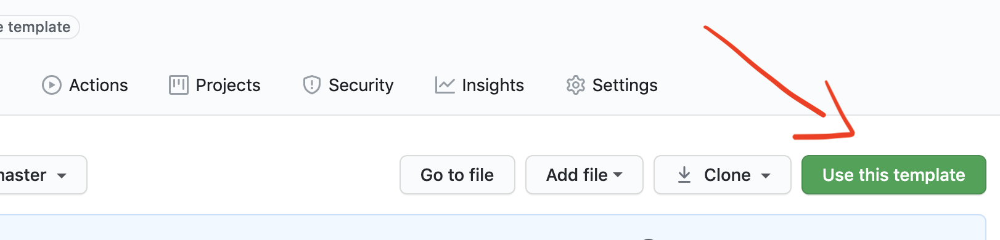

# React-PWA - `v2` is here 🚀🎉⚡️

```bash
git config --unset core.hooksPath
```

#### Husky

You can use [husky](https://typicode.github.io/husky/#/) to lint your commit messages, run tests, lint code, etc.

Currently, only `pre-commit` hook is set up. Every time you try to do a commit it will run `prettier` and `eslint` to be sure that everything is according to the rules.

#### Lint-staged

[lint-staged](https://github.com/okonet/lint-staged) helps to run `eslint` and `prettier` only on staged files - it makes the linting process super fast and sensible.

#### https localhost

[https localhost](https://github.com/daquinoaldo/https-localhost) is a simple way to run your application on localhost with https.

Just run:

```bash
npm run https-preview # or yarn https-preview
```

after:

```bash
npm run build # or yarn build
```

and check `https://localhost` in your browser.

NOTE: the first time it will ask you about installing localhost certificate. For more info check [this](https://github.com/daquinoaldo/https-localhost#root-required)

## Usage

You can use this template by just pressing `Use this template`.



Or you can fork/clone it.

Install dependencies:

```bash
npm install # or yarn
```

In order to run it in development, run:

```bash
npm run dev # or yarn dev
```

In order to do a production build, run:

```bash
npm run build # yarn build
```

```bash
npx prettier --check ./src
```

## License

[MIT](./LICENSE)
